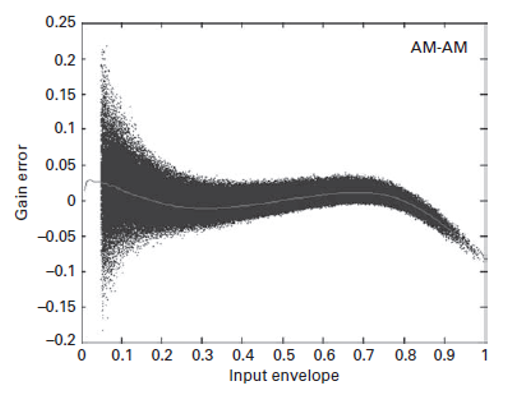
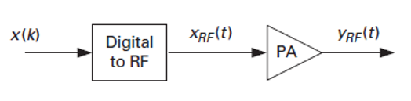

本篇以通信的下行过程举例，涵盖信号从 BBU 到天线发射出去中间的过程，讲解 RRU 的工作流程。中间会专门展开一节介绍两种上变频架构，因为 AFE 链路的形状完全取决于架构类型。

## DFE ( Digital Front End )

假设基带发送一个 5G NR 信号，信号从 BBU 发送到 RRU 时，全部为数字信号，首先进入 DFE，内部全部为 FPGA 或者 ASIC 的数字逻辑。

按照 DFE 内的工作流程，BBU 传入的 IQ 数据将首先进行数字滤波，仅保留需要的频谱，随后对滤波后的 IQ 数据进行插值，以提高采样率。完成后进入 DUC（Digital Up Conversion），**但 DUC 把信号搬到哪里，取决于后级用的是哪种架构** —— 如果是超外差架构，它将搬频至一个非零的数字中频，但如果是零中频架构，它只负责多载波的频偏摆放和速率提升，整个频谱的中心仍然留在直流附近。

后面 DPD 要处理的是 PA 的非线性产物，三阶、五阶交调会把频谱展宽到信号带宽的三到五倍，**如果采样率不够，这些展宽出来的分量会直接折叠回带内**，导致预失真起反作用。所以插值要先把采样率提高到能容纳这个展宽的程度。

随后，通过 CFR（Crest Factor Reduction）算法进行削峰以降低信号峰均比。OFDM 信号是大量子载波相加的结果，峰均比极高，而 PA 必须按峰值功率来进行选型和回退。削掉偶发的尖峰，PA 的平均输出功率就能获得提高（实际上如果不进行削峰，PA在高功率下的信号存在巨大的压缩，在这种情况下任何 DPD 也难以将信号恢复）。而削峰本质上是对信号的破坏，会恶化 EVM 并抬高带外噪声，所以削峰的量必须在 PA 效率和调制质量指标间折中考虑。

削峰之后通过 DPD（Digital Predistortion）算法进行数字预失真。PA 在接近饱和的区间是非线性的，DPD 的做法是在数字域先乘上一个近似的反函数，让预失真器和 PA 级联之后整体看起来是线性的。这个反函数的参数随温度、器件老化和输出功率变化，所以必须靠耦合反馈不断更新。


## 两种上变频架构

把基带搬到射频有两类不同的架构，分别为超外差和零中频。

### 超外差 ( Superheterodyne )

```text
基带 IQ -> DUC 搬到数字中频 -> 单路 DAC -> 模拟中频(实信号)
        -> 实混频器 × LO -> 和频与差频同时存在 -> 带通滤波选一个边带 -> PA
```

这种架构下，DUC 把信号搬到非零的数字中频，DAC 输出的是**实信号**，不再是 I 和 Q 两路。接着实混频器把中频和本振相乘，根据积化和差，输出同时包含两个边带：

$$
\cos(\omega_{LO} t)\cos(\omega_{IF} t)
= \tfrac{1}{2}\cos\big((\omega_{LO}+\omega_{IF})t\big)
+ \tfrac{1}{2}\cos\big((\omega_{LO}-\omega_{IF})t\big)
$$

也就是 $f_{LO}+f_{IF}$ 和 $f_{LO}-f_{IF}$，其中一个是我们想要的数字中频，另一个是低频的镜像。之后通过一个带通滤波器得到我们需要的频率。

这种情况下，整条链路里不存在 I 和 Q 两路，也就不存在两路之间的匹配问题。但中频带通滤波器往往是声表面波器件或者腔体滤波器，体积大、成本高、而且中心频率固定不可调，更换频段必须更换滤波器。在多频段、大带宽的场景下滤波器的数量会迅速膨胀，因此它在新设备里越来越少见。

### 零中频 ( Zero-IF / Direct Conversion )

```text
基带 IQ -> DUC 只做载波摆放与插值，频谱中心仍在直流
        -> 双路 DAC 分别输出 I 和 Q -> IQ 调制器(正交本振) -> 直接到射频 -> PA
```

这种架构下 DAC 为两路，分别输出 I 和 Q 的模拟波形。调制器内部把本振分成相位相差 90 度的两路，分别和 I、Q 相乘之后相加：

$$
s(t) = I(t)\cos(\omega_{LO} t) - Q(t)\sin(\omega_{LO} t)
$$

把它写成复数形式，令 $z(t) = I(t) + jQ(t)$，则上式等于 $\mathrm{Re}\left[ z(t)\,e^{j\omega_{LO} t} \right]$ —— 复基带信号被整体搬到了 $f_{LO}$ 上，**频谱没有被折叠**，所以不存在需要滤掉的频率。

关键在于，这个结构**理想情况下根本不产生镜像**。镜像边带是被 I 和 Q 两路的正交关系**对消**掉的，而不是被滤波器滤掉的。这是零中频和超外差最本质的区别 —— 前者用数学对消，后者用滤波器选择。所以零中频链路里没有中频的带通滤波器。

当然，现实里对消不可能完美。残余镜像来自于 I、Q 两条支路的幅度不平衡和相位偏差，这个偏差一路累积自 DAC、重建低通滤波器和混频器本身，最终体现为**镜像抑制比**这个指标。零中频还有另外两个特有的损伤：

1. 本振泄漏，它直接落在载波中心，在基带上看就是一个直流偏移，而且因为它在带内，滤波器完全无能为力。
2. I、Q 两路的直流失调，表现和本振泄漏叠在一起。

这些都只能靠校准解决，具体做法是在 DFE 里加一个补偿矩阵和一组直流偏置，把失配预先反向补回去。**所以零中频并没有把问题消灭，它是把"做一个好的滤波器"的问题换成了"做一套好的校准"的问题。** 镜像抑制和本振泄漏的最终指标完全取决于校准精度和温漂稳定性，因此出厂校准之外通常还要有在线的周期校准。

### 架构选择

现在的 5G 基站基本都选用零中频的架构，因为其带宽大、频段多、且通道数多。超外差固定中心频率的中频滤波器无法实现，而零中频换频段只需要改本振，通道复制的成本也较低。

## AFE ( Analog Front End )

在完成了 DFE 中的 CFR 和 DPD 处理后，信号离开数字域，进入 AFE。下面均使用零中频架构进行描述。

首先通过 DAC 进行数模转换，把数字域的 I 和 Q 分别转换为**模拟域**的两路波形，DAC 之后各有一个重建低通滤波器，用来滤掉采样产生的镜像和带外噪声。

随后信号进入 TRX 芯片，内部的关键部分是频率综合器和 IQ 调制器。外部参考时钟进入 PLL，PLL 通过相位检测和环路滤波产生控制电压调谐 VCO，VCO 的输出（通常再经过分频）就是送给混频器的本振信号。本振产生之后进入 IQ 调制器，和 I、Q 两路相乘相加，信号被直接搬到射频。

## PA ( Power Amplifier )

经过了 AFE 的处理后，信号已经成为一个射频信号，但功率还远远不够，PA 负责提供增益，把它放大到天线口需要的发射功率。



PA 是整条链路里效率最低的一部分，直接关系到用户的站上能源成本。

最终，Coupler 耦合极小部分的 PA 输出端信号送回系统，用于功率检测和 DPD 的反馈。这条反馈路径自己也是一个完整的接收链路 —— **耦合出来的信号要先经过自己的下变频和 ADC 回到数字域**，这一路通常被称作观测接收机。DPD 的自适应算法获取这一路的观测数据，把 PA 的实际输出和期望输出做比较，据此更新预失真的参数。

另外，PA 到天线之间并不是直通的。基站的收发共用同一副天线，FDD 靠双工器或者环形器按频率分开，TDD 则靠射频开关按时间分开，5G NR 的多数频段是 **TDD**。

## Antenna

完成 PA 的放大后，信号从天线以电磁波的形式发射出去。

天线的大小与信号的波长有关，这也是需要将发射频率设定在高频的其中一个原因，否则在基带信号附近将导致需要的天线大小几乎无穷大。

## 上行链路

上行方向基本相反，结构基本如下：

```text
天线 -> 双工器 / TDD 开关 -> LNA -> 下变频 -> ADC
     -> DDC -> 抽取 -> 数字滤波 -> BBU
```

上行链路不再需要PA，而是使用**LNA（Low Noise Amplifier）**。上行过程中不需要将信号放大进行发射，但由于上行信号到达天线口时功率极低，因此也必须将其进行放大，才能进行接下来的变频和采样操作。

LNA 的接收灵敏度可以写成：

$$
P_{\min} = -174\,\mathrm{dBm/Hz} + 10\log_{10}(B) + NF + SNR_{\mathrm{req}}
$$

其中的噪声系数 $NF$ 由整个接收链级联决定。

上行与下行的另一个区别是其不必使用CFR 和 DPD。接收侧既没有 PA 也没有峰均比的问题，不存在反向的对应过程。接收侧在数字域的对应物是 DDC（Digital Down Conversion）和抽取，把 ADC 出来的高采样率数据搬回基带并降到 BBU 需要的速率。
